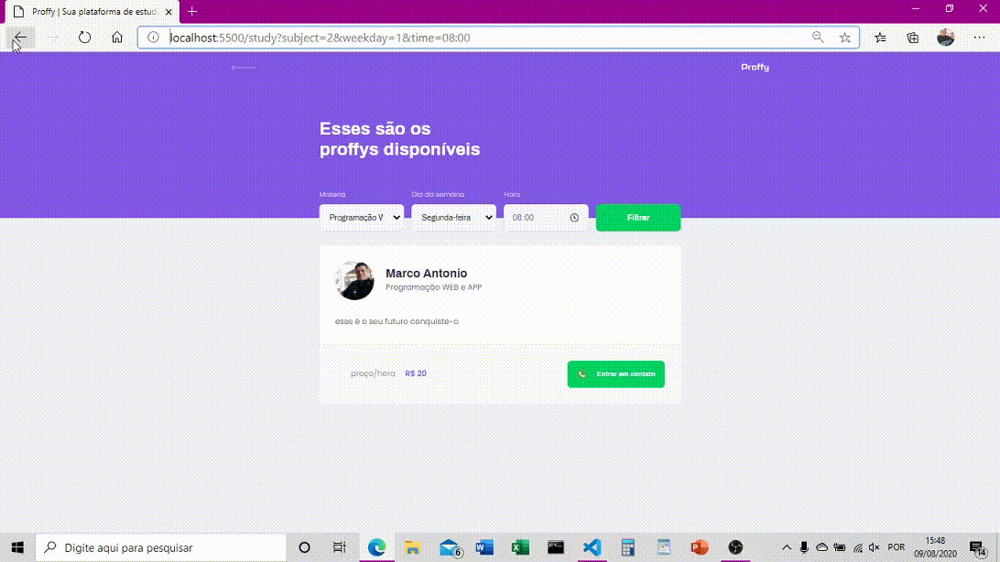

<h1></h1>
<h1> 
</h1>

# Índice
- [Sobre](#-Sobre)
- [Tecnologias utilizadas](#-Tecnologias-utilizadas)
- [Como utilizar o projeto](#-Como-utilizar-o-projeto)
___

## 🔖 Sobre

O projeto **Proffys** é uma plataforma de estudo com cadastro de professores baseado no projeto para web e mobile do **FIGMA** do curso **Bootcamp  ROCKETSET** com o intuito de melhorar o pórtifolio dos DEVs.
___
## 🚀 Tecnologias utilizadas

O projeto foi desenvolvidos com as seguintes tecnologias

- [Nodejs](https://nodejs.org/en/)
- HTML5
- JS
- CSS
- [JSON](http://www.json.org/json-pt.html)
- [SQLite](https://sqlite.org/download.html)
___
## 🎁 Como utilizar o projeto

```bash
   
   # aqui você vai clonar meu repositório
   $ git clone https://github.com/devMarcoAntonio/Proffys

   # aqui você entrara no diretório do projeto, eu usei vscode, recomendo
   $ cd NLW

   # aqui voce rodara um servidor localhost do seu browser para visualisar o projeto
   $ npm run dev
```

Desenvolvido✨ por Marco Antonio Figueiredo Braz

